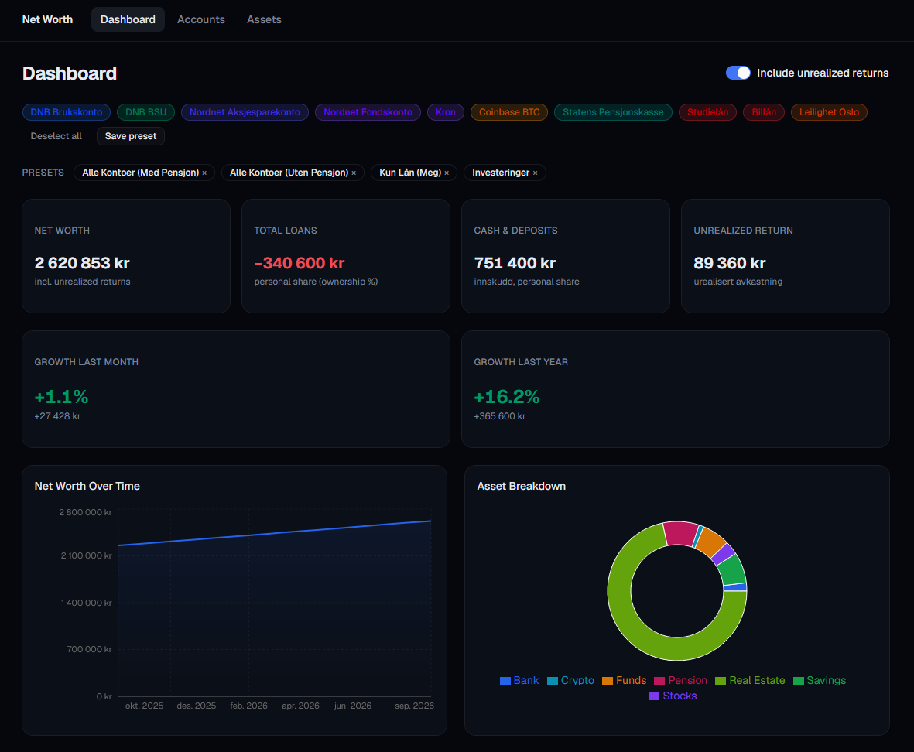

# Net Worth Tracker

A personal net worth tracker with manual data entry. Log account balances at any point in time and visualize your net worth over time — including loans, crypto, funds, and shared assets.

> Screenshot below uses mock data — no real financial data is included in this repository.



## Features

- Manual balance snapshots per account (no bank integrations or transaction tracking)
- Separates deposited capital from unrealized returns
- Handles partial ownership (e.g. 50% of a shared home + mortgage)
- Charts: net worth over time, asset breakdown by type
- Growth metrics: last month and last year
- Toggleable filters: include/exclude unrealized returns, save account presets
- Assets with estimated value growth (real estate, vehicles)
- Export / import data as JSON for backup and device transfer

## Stack

- **Frontend**: Next.js / Tailwind CSS / shadcn/ui
- **Storage**: IndexedDB (in-browser, no server required)

## Requirements

- [Bun](https://bun.sh/) — JavaScript runtime and package manager

## Installation

```bash
git clone https://github.com/robino16/networth.git
cd networth/frontend
bun install
```

## Running

```bash
# From /frontend
bun dev
```

The app runs at [http://localhost:3000](http://localhost:3000). No backend or database setup needed — all data is stored locally in your browser's IndexedDB.

## Data and privacy

All data lives in your browser. Nothing is sent to any server. To back up or move your data, use the **Export** button on the Accounts page — this downloads a JSON file you can re-import on any device or browser.

## Usage

The app is built around two concepts: **accounts** (financial accounts you track manually) and **assets** (physical assets whose value is estimated automatically).

### 1. Add your accounts

Go to **Accounts → Add Account**. For each account, set:

- **Name** — e.g. "DNB Brukskonto", "Nordnet Fondskonto"
- **Type** — Bank, Savings, Funds, Stocks, Crypto, Pension, Loan, or Other
- **Ownership %** — useful for shared accounts (e.g. 50% for a joint savings account)
- **Currency** — defaults to NOK

Loans should use type **Loan** and balances entered as negative values — they are shown in red and subtracted from your net worth.

### 2. Log a snapshot

From the Accounts list, click the **refresh icon** on any account to log today's balance. You enter:

- **Deposit** — the amount you have put in (or the remaining loan balance as a negative number)
- **Unrealized return** — any gain on top of your deposit (e.g. for funds or stocks)

The dashboard and charts update immediately. I recommend logging snapshots once a month — e.g. right before or after every paycheck. Set a recurring reminder and you'll build up a clear picture of your growth over time.

### 3. Add assets

Go to **Assets → Add Asset** for physical assets — real estate, vehicles, etc. Provide a purchase price, annual growth rate, and ownership percentage. The app estimates the current value automatically and includes it in your net worth.

### 4. Dashboard and filters

The **Dashboard** shows total net worth, loan exposure, deposits, and unrealized returns. Use the account chips at the top to include or exclude specific accounts. Save preferred selections as **presets** (e.g. "All accounts", "Investments only") for quick switching.

Toggle **Include unrealized returns** to compare your net worth with and without paper gains.

---

Most of this solution was created with [Claude Code](https://claude.ai/code) following my coding guidelines. It is just a quick personal project — but for me this app is genuinely helpful.

## Contributing / Development

To populate the app with realistic fake data for testing or screenshots, run the seed script and import the output:

```bash
cd backend
uv run python seed_mock.py        # creates networth.db
uv run python migrate_to_json.py --db networth.db --out seed.json
```

Then use **Accounts → Import** to load `seed.json` into the app.
